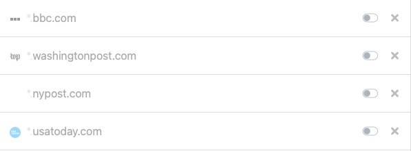

# nextdns-block-toggle
Toggles a list of domains as blocked or not via NextDNS API. Let's say you really want to block all social media over the weekend so you can ensure you are focusing on *who* you want when you are with them. With this tool, you can add those domains to a text file, and periodically block/allow those domains at will.

Sample script run:
```
python3 toggle.py -f domains.txt --block
```

Output:
```
Found 'Home Profile' (99XXXX)
Success: True
```

Example `domains.txt`
```
nbcnews.com
usatoday.com
nypost.com
washingtonpost.com
bbc.com
```

After unblocking with `--un-block` flag, NextDNS denylist will look something like this:


## Setup
- Make sure you have (I think) at least version 3.6 of python and install pip requirements file (`pip3 -m install -r requirements.txt`)
- Make a `.secret` file with just your NextDNS API key on one line - nothing else
- Make a txt file with any domains you want to block/un-block -- one domain per line
